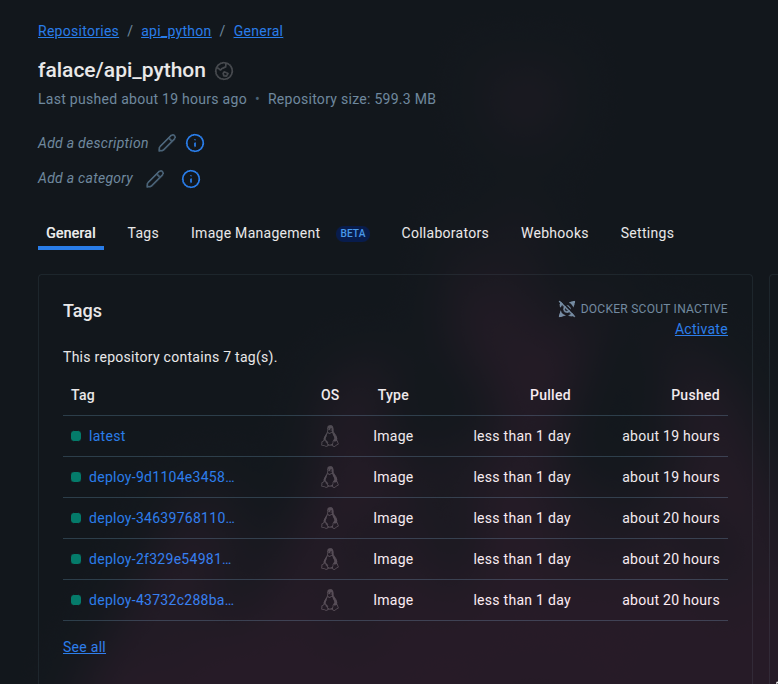

<h1 align="center">FastApi Service</h1>
<p align="center"> <i>Api com CI/CD e deploy via Argo CD</i></p>

## Resumo
Este repositório demonstra um **deploy automatizado** de ponta a ponta: a cada push/merge na branch `main`, a imagem Docker é construída e publicada. O CI/CD abre um **Pull Request** no repositório de manifests atualizando a **imagem referenciada**; e, após a aprovação, o `Argo CD` sincroniza automaticamente as mudanças no **cluster Kubernetes**.

### Requisitos
* Conta Dockerhub 
* Conta GitHub
* Cluster Kubernetes (Rancher Desktop, Minikube, Kind)

### Topicos
* [Visão Geral](#visão-geral)
* [Estrutura](#estrutura-do-repositorio)
* [Configuração Secrets GitHub Actions](#configuração-secrets-github-actions)
* [Como Rodar a Aplicação](#como-rodar-a-aplicação)
* [Configuração do Workflow](#configuração-do-cicd)
  * [Job - Build - Imagem](#build)
  * [Job - Build - Dockerhub](#dockerhub)
  * [Job - Deploy - Manifesto](#deploy)

## Links Rapidos
- CI/CD: `./.github/workflows/deploy.yml`
- Dockerfile: `./Dockerfile`
- Repo de Manifests: https://github.com/alexsandroocanha/FastApi-Service-Manifests 

## Visão geral
> Este repositório contém um microserviço **FastAPI** empacotado em **Docker** e integrado a um pipeline de **CI/CD** no GitHub Actions. O fluxo é: **build → push da imagem → PR automático no repo de manifests** (atualizando a tag/sha da imagem) → **sync do Argo CD** no cluster Kubernetes.

## Estrutura do repositorio
Este projeto é dividido em 2 repositórios:
1. **Aplicação & CI/CD (este repo)**
     * Contém o código da API (FastAPI), Dockerfile e o workflow do GitHub Actions para buildar e publicar a imagem no Docker Hub (ou outro registry).

>```
>├─ .github/workflows/deploy.yml
>├─ main.py
>├─ requeriments.txt
>└─ Dockerfile
>```


2. Manifestos Kubernetes & ArgoCD (repo separado)
    * Contém os manifests K8s (Deployment/Service/etc.) e o Application do ArgoCD que consome a imagem publicada e faz o deploy/sync no cluster.

> ```
> ├─ ArgoCD/
> │  └─ argocd.yml
> ├─ k8s/
> │  └─ base-k8s.yml
> ├─ deployment-v1.yaml
> └─ README.md
> ```


---

## Como rodar a aplicação
Primeiro você tera que clonar o repositorio
```bash
git clone https://github.com/alexsandroocanha/FastApi-Service
```

Após isso você precisará criar um novo repositorio na sua conta `Github`, após criar você tera que modificar o origin do github do `repositorio clonado`.

```
git remote set-url origin <novo_url>
```

## Configuração Secrets (GitHub Actions)

Caso queira utilizar este modelo de repositorio, antes de iniciar, você necessitara de incrementar algumas Variaveis de Ambientes(secrets) obrigatorioas.

| Nome              | Obrigatória | Descrição breve                                   |  
|-------------------|-------------|---------------------------------------------------|
| DOCKER_PASSWORD   | sim         | Token de acesso para a sua conta no docker hub    |
| DOCKER_USERNAME   | sim         | Usuario da sua conta docker hub                   |
| SSH_KEY           | sim         | Chave ssh para acessar o seu repositorio git hub  |
| REPO_GIT          | sim         | Link para o `segundo repositorio`                 |

## Configuração do CI/CD
O workflow ficou separado em 2 jobs, a build da imagem da aplicação e outro para o Pull Request no repositorio de Manifesto

### Build:


```yaml
Build:
        runs-on: ubuntu-latest
        environment: Docker # Enviroment aonde as suas secrets estão localizadas
        steps:
            - name: Use actions checkout
              uses: actions/checkout@v4

            - name: Login from Docker
              uses: docker/login-action@v3
              with:
                username: ${{ secrets.DOCKER_USERNAME }}
                password: ${{ secrets.DOCKER_PASSWORD }}

            - name: Build and push
              uses: docker/build-push-action@v6
              with:
                context: .
                file: ./dockerfile
                push: true
                tags: |
                  # A imagem sobe com o hash do commit como tag
                  usuario/nome-da-aplicacao:deploy-${{github.sha}} 
                  usuario/nome-da-aplicacao
```

### Dockerhub
As imagens que irão para o dockerhub seguirão este modelo



<br>

### Deploy:
Este job é responsavel por deploya o manifesto para o `segundo repositorio`. 
> O deploy sobe com um manifesto que ira  para o `segundo repositorio`. Caso queira alterar alguma coisa, você tera que alterar diretamente o Workflow.

```yaml
    Deploy:
        runs-on: ubuntu-latest
        needs: Build
        environment: Docker # Enviroment aonde as suas secrets estão localizadas
        steps:
            - name:  Create new repo
              run: mkdir ~/Pasta
              
            - name: Add ssh key
              uses: webfactory/ssh-agent@v0.9.0
              with:
                  ssh-private-key: ${{ secrets.SSH_KEY }}

            - name: Add git hub
              run: git clone ${{ secrets.REPO_GIT }} ~/Pasta
            

            - name: Create new manifest
              run: |
                cat > ~/Pasta/deployment-v1.yaml <<EOF
                apiVersion: apps/v1
                kind: Deployment
                metadata:
                  name: hello-api
                  namespace: argocd
                  labels:
                    app: hello-api
                spec:
                  strategy:
                    type: RollingUpdate
                    rollingUpdate:
                      maxUnavailable: 100%  
                      maxSurge: 0            
                  revisionHistoryLimit: 1
                  replicas: 3
                  selector:
                    matchLabels:
                      app: hello-api
                  template:
                    metadata:
                      labels:
                        app: hello-api
                    spec:
                      containers:
                        - name: hello-api
                          image: usuario/nome-da-aplicacao:deploy-${{github.sha}}
                          ports:
                            - containerPort: 8000
                          readinessProbe:
                            httpGet:
                              path: /
                              port: 8000
                            initialDelaySeconds: 5
                            periodSeconds: 10
                          livenessProbe:
                            httpGet:
                              path: /
                              port: 8000
                            initialDelaySeconds: 10
                            periodSeconds: 20

                ---

                apiVersion: v1
                kind: Service
                metadata:
                  name: hello-api
                  namespace: argocd
                spec:
                  type: NodePort
                  selector:
                    app: hello-api
                  ports:
                    - name: http
                      port: 8000
                      targetPort: 8000 
                      nodePort: 30080


                EOF
            
            - name: Pull Request
              run: |
                cd ~/Pasta
                git config --global user.email "41898282+github-actions[bot]@users.noreply.github.com"
                git config --global user.name "github-actions[bot]"
                BRANCH="chore/new-manifest-${GITHUB_SHA::7}"
                git checkout -b "$BRANCH"
                git add .
                git commit -m "chore: add deployment-v2 with tag ${GITHUB_SHA::7}"
                git push -u origin "$BRANCH"
      
```


### Considerações Finais
Este é o primeiro repositorio, para dar continuidade iremos para o segundo repositorio.

[](https://github.com/alexsandroocanha/FastApi-Service-Manifests)


### Informações para Contato

[](https://www.linkedin.com/in/alexsandro-ocanha-rodrigues-77149a35b/)
[](https://www.instagram.com/alexsandro.pcap/)
[](mailto:alexsandroocanha@gmail.com)