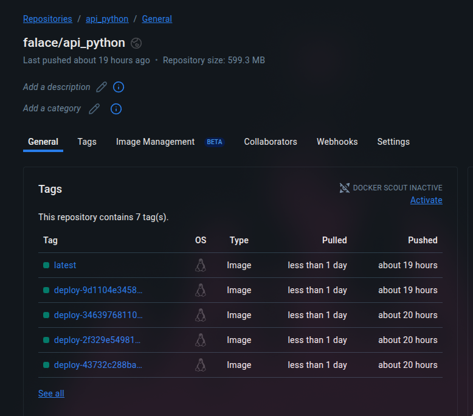

<h1 align="center">FastApi Service</h1>
<p align="center"> <i>CI/CD API with deployment from Argo CD</i></p>

## Resum
This repository demonstrate **end-to-end** automated deploy. With each push and merge on to branch `main`, the docker image is built and publish on Docker Hub. The CI/CD opens a **Pull Request** in the `manifest repository`, updating the Application Image, and, after approval, ArgoCD synchronizes the changes in the Kubernetes cluster.

### Requiriments
* DockerHub Account
* GitHub Account
* Cluster Kubernetes (Rancher Desktop, Minikube, Kind)

### Additionals informations
> If you are going to use this repository, start with the _manifest repository_. It will be essential for the Workflow
>
> [](https://github.com/alexsandroocanha/FastApi-Service-Manifests)

### Topics
* [Overview](#overview)
* [Repository Structure](#structure-repository)
* [Configure GitHub Actions token secrets](#secret-token-configuration-gitHub-actions)
* [How to run the application](#how-to-run-the-application)
* [Workflow Configuration](#workflow-configuration)
  * [Job - Build - Imagem](#build)
  * [Job - Build - Dockerhub](#dockerhub)
  * [Job - Deploy - Manifesto](#deploy)

## Fast Links
- CI/CD: `./.github/workflows/deploy.yml`
- Dockerfile: `./Dockerfile`
- Manifests Repository: https://github.com/alexsandroocanha/FastApi-Service-Manifests 

## Overview
> This repository contains a **FastAPI microservice**, transformed into a **Docker image** and integrated with a GitHub Actions workflow.

## Structure Repository
Is this project and divided into 2 repositories:
1. **Aplication & CI/CD**
     * It contains  the FastAPI code, Dockerfile and GitHub Actions workflow.

>```
>├─ .github/workflows/deploy.yml
>├─ main.py
>├─ requeriments.txt
>└─ Dockerfile
>```


2. Kubernetes Manifest & ArgoCD 
    * It contains the K8S manifest and ArgoCD manifest.

> ```
> ├─ ArgoCD/
> │  └─ argocd.yml
> ├─ k8s/
> │  └─ base-k8s.yml
> ├─ deployment-v1.yaml
> └─ README.md
> ```


---

## How to run the application
First step, clone this repository.
```bash
git clone https://github.com/alexsandroocanha/FastApi-Service
```

Modify remote state in the Repository

```
git remote set-url origin <new_url>
```

## Secret Token Configuration (GitHub Actions)

Increment as environment variable

| Name              | Required    | Description                                       |  
|-------------------|-------------|---------------------------------------------------|
| DOCKER_PASSWORD   | yes         | Docker Hub access token                           |
| DOCKER_USERNAME   | yes         | Docker Hub username                               |
| SSH_KEY           | yes         | SSH private key for GitHub access                 |
| REPO_GIT          | yes         | URL of the external Git repository                |

## WorkFlow Configuration
O workflow ficou separado em 2 jobs, a build da imagem da aplicação e outro para o Pull Request no repositorio de Manifesto

### Build:


```yaml
Build:
        runs-on: ubuntu-latest
        environment: Docker
        steps:
            - name: Use actions checkout
              uses: actions/checkout@v4

            - name: Login from Docker
              uses: docker/login-action@v3
              with:
                username: ${{ secrets.DOCKER_USERNAME }}
                password: ${{ secrets.DOCKER_PASSWORD }}

            - name: Build and push
              uses: docker/build-push-action@v6
              with:
                context: .
                file: ./dockerfile
                push: true
                tags: |
                  usuario/nome-da-aplicacao:deploy-${{github.sha}} 
                  usuario/nome-da-aplicacao
```

### Dockerhub
Images published on Docker Hub will follow this naming convention:



<br>

### Deploy:
This job is responsible for deploying the manifest to the second repository.
> The deployment uses a manifest sent to the second repository.
> Any changes must be made directly in the workflow.

```yaml
    Deploy:
        runs-on: ubuntu-latest
        needs: Build
        environment: Docker 
        steps:
            - name:  Create new repo
              run: mkdir ~/Pasta
              
            - name: Add ssh key
              uses: webfactory/ssh-agent@v0.9.0
              with:
                  ssh-private-key: ${{ secrets.SSH_KEY }}

            - name: Add git hub
              run: git clone ${{ secrets.REPO_GIT }} ~/Pasta
            

            - name: Create new manifest
              run: |
                cat > ~/Pasta/deployment-v1.yaml <<EOF
                apiVersion: apps/v1
                kind: Deployment
                metadata:
                  name: hello-api
                  namespace: argocd
                  labels:
                    app: hello-api
                spec:
                  strategy:
                    type: RollingUpdate
                    rollingUpdate:
                      maxUnavailable: 100%  
                      maxSurge: 0            
                  revisionHistoryLimit: 1
                  replicas: 3
                  selector:
                    matchLabels:
                      app: hello-api
                  template:
                    metadata:
                      labels:
                        app: hello-api
                    spec:
                      containers:
                        - name: hello-api
                          image: usuario/nome-da-aplicacao:deploy-${{github.sha}}
                          ports:
                            - containerPort: 8000
                          readinessProbe:
                            httpGet:
                              path: /
                              port: 8000
                            initialDelaySeconds: 5
                            periodSeconds: 10
                          livenessProbe:
                            httpGet:
                              path: /
                              port: 8000
                            initialDelaySeconds: 10
                            periodSeconds: 20

                ---

                apiVersion: v1
                kind: Service
                metadata:
                  name: hello-api
                  namespace: argocd
                spec:
                  type: NodePort
                  selector:
                    app: hello-api
                  ports:
                    - name: http
                      port: 8000
                      targetPort: 8000 
                      nodePort: 30080


                EOF
            
            - name: Pull Request
              run: |
                cd ~/Pasta
                git config --global user.email "41898282+github-actions[bot]@users.noreply.github.com"
                git config --global user.name "github-actions[bot]"
                BRANCH="chore/new-manifest-${GITHUB_SHA::7}"
                git checkout -b "$BRANCH"
                git add .
                git commit -m "chore: add deployment-v2 with tag ${GITHUB_SHA::7}"
                git push -u origin "$BRANCH"
      
```


### Final Considerations
This is the first repository. To continue, we will move on to the second repository.

[](https://github.com/alexsandroocanha/FastApi-Service-Manifests)

### Contact Information

[](https://www.linkedin.com/in/alexsandro-ocanha-rodrigues-77149a35b/)
[](https://www.instagram.com/alexsandro.pcap/)
[](mailto:alexsandroocanha@gmail.com)
